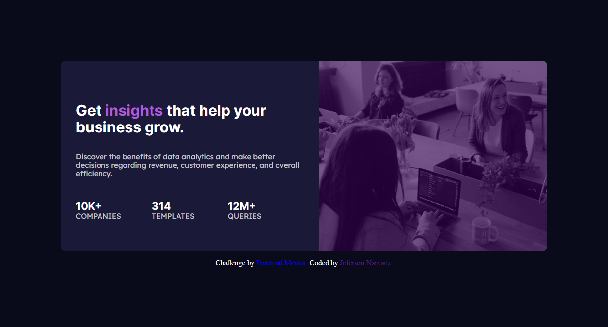

# Frontend Mentor - Stats preview card component solution

This is a solution to the [Stats preview card component challenge on Frontend Mentor](https://www.frontendmentor.io/challenges/stats-preview-card-component-8JqbgoU62). Frontend Mentor challenges help you improve your coding skills by building realistic projects. 

## Table of contents

- [Overview](#overview)
  - [The challenge](#the-challenge)
  - [Screenshot](#screenshot)
  - [Links](#links)
- [My process](#my-process)
  - [Built with](#built-with)
  - [What I learned](#what-i-learned)
- [Author](#author)


## Overview

### The challenge

Users should be able to:

- View the optimal layout depending on their device's screen size

### Screenshot




### Links

- Solution URL: [Github](https://github.com/MegalLink/stats-preview-card-componen-FEM-Challengue)
- Live URL: [Live](https://stats-preview-card-componen-fem-challengue.vercel.app)

## My process
I just used css with flexbox to make everything responsive and media query
### Built with

- Semantic HTML5 markup
- CSS custom properties
- Flexbox
- Mobile-first workflow


### What I learned

I learned how to change between two images resources in the html document with the element source
````html
<picture>
    <source srcset="./images/image-header-desktop.jpg" media="(min-width: 768px)" />
    
</picture>
````
```css
picture {
  width: 100%;
  height: 100%;
  background-color: hsl(277, 100%, 30%);
  filter: brightness(0.7);
}
.image {
  width: 100%;
  height: 100%;
  min-width: 250px;
  z-index: 100;
  opacity: 0.5;
}
```
## Author

- Website - [Github](https://github.com/MegalLink/)
- Frontend Mentor - [@MegalLink](https://www.frontendmentor.io/profile/MegalLink)
